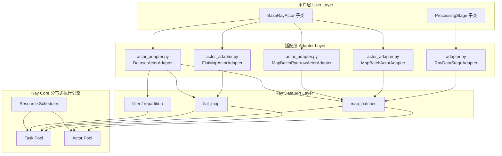
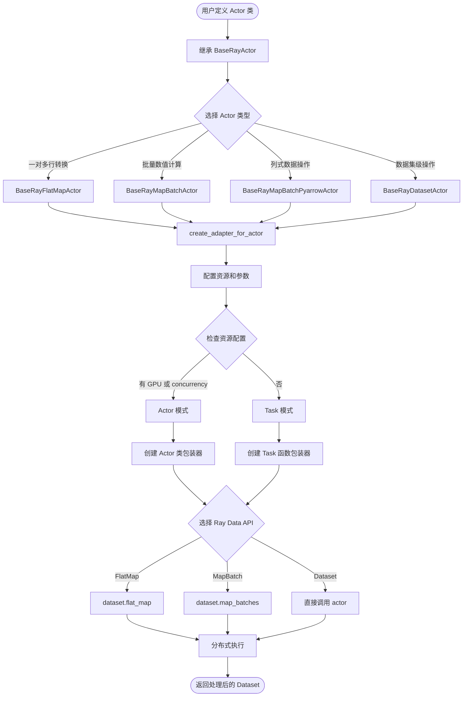
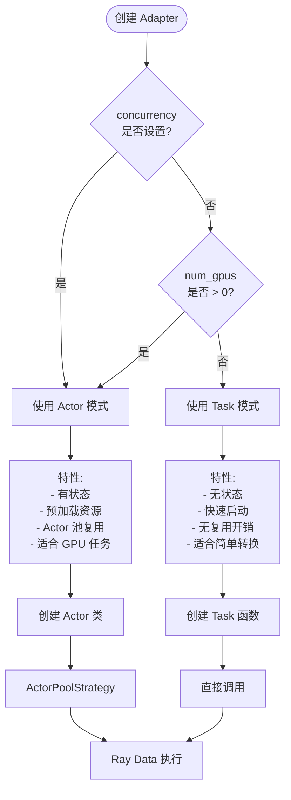
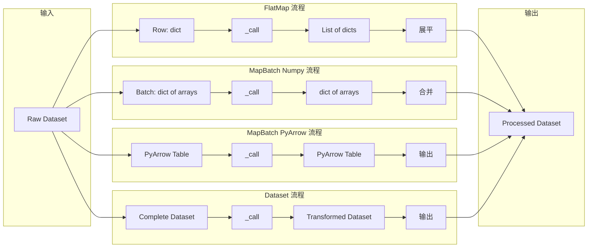
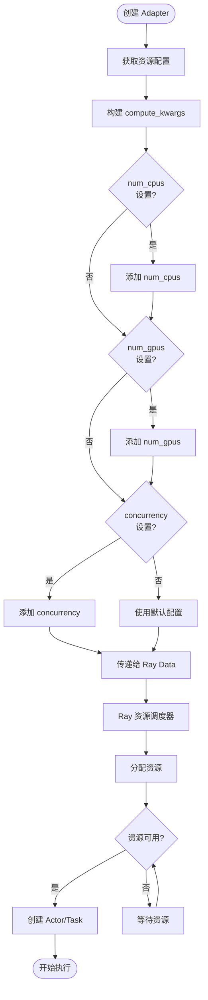
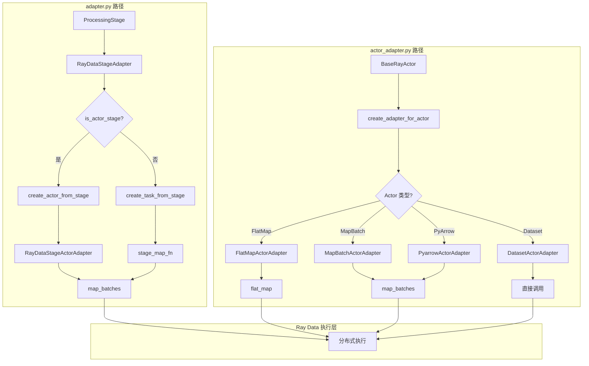
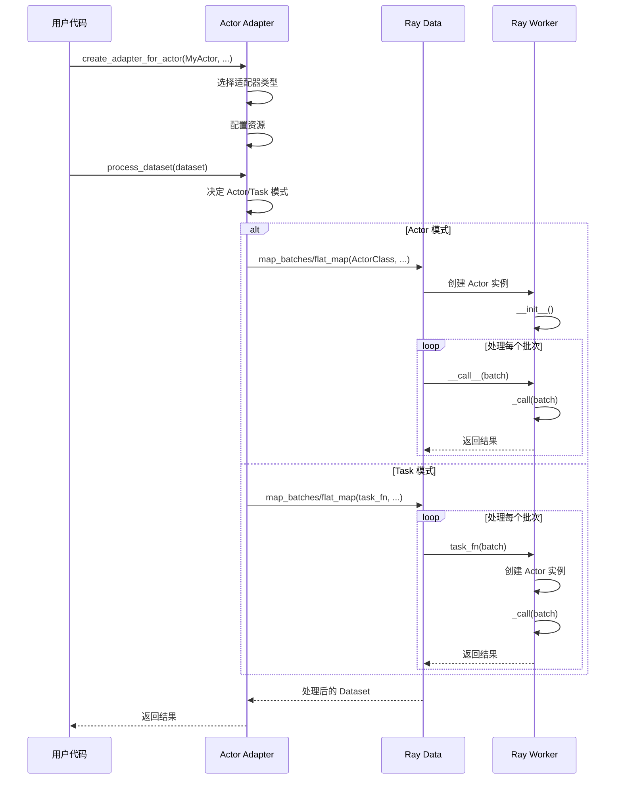
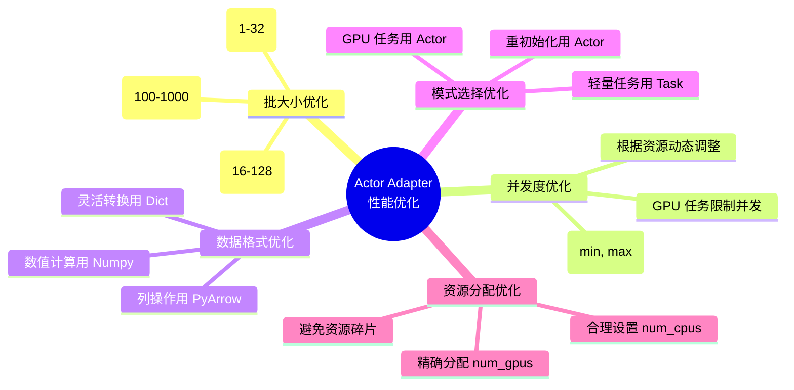
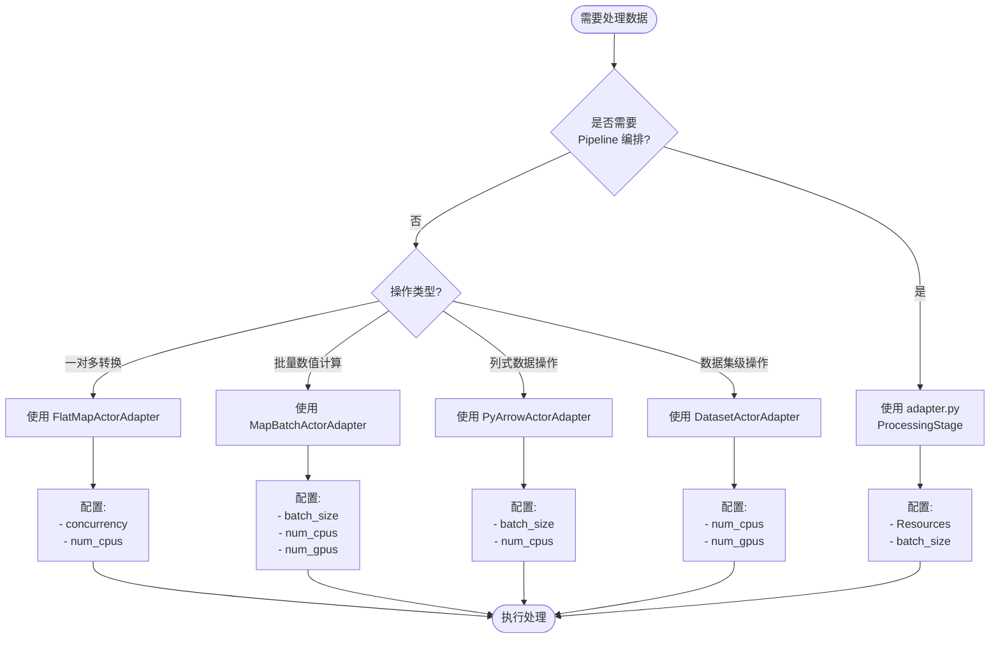

# Actor Adapter Layer 架构图

## 总体架构图



## Actor Adapter 详细流程图



## Actor vs Task 模式决策树



## 数据流转图



## Exclude Columns 处理流程

```mermaid
flowchart TD
    Start([输入数据]) --> Check{exclude_columns<br/>设置?}
    
    Check -->|None or []| NoExclude[保留所有列]
    Check -->|list of columns| ExcludeList[排除指定列]
    Check -->|'*'| ExcludeAll[排除所有原始列]
    
    NoExclude --> Process[处理数据]
    ExcludeList --> RemoveColumns[删除指定列]
    ExcludeAll --> RemoveAll[删除所有原始列]
    
    RemoveColumns --> Process
    RemoveAll --> Process
    
    Process --> UserLogic[用户 _call 方法]
    UserLogic --> Result[生成新数据]
    Result --> Merge{合并策略}
    
    Merge -->|FlatMap| MergeRow[合并到行字典]
    Merge -->|MapBatch| MergeBatch[合并到批字典]
    Merge -->|PyArrow| MergeTable[添加到 Table]
    
    MergeRow --> Output([输出结果])
    MergeBatch --> Output
    MergeTable --> Output
```

## 资源分配流程



## 对比：adapter.py vs actor_adapter.py



## 执行生命周期



## 错误处理流程

```mermaid
flowchart TD
    Start([开始处理]) --> Execute[执行 _call]
    
    Execute --> Check{是否出错?}
    Check -->|否| Success[返回结果]
    Check -->|是| Catch[捕获异常]
    
    Catch --> Log[_log_error 记录]
    Log --> ActorType{Actor 类型?}
    
    ActorType -->|FlatMap| ReturnEmpty1[返回空列表 []]
    ActorType -->|MapBatch| ReturnEmpty2[返回空字典 {}]
    ActorType -->|PyArrow| ReturnEmpty3[返回空 Table]
    ActorType -->|Dataset| ReturnEmpty4[返回空 Dataset]
    
    ReturnEmpty1 --> Continue[继续处理其他数据]
    ReturnEmpty2 --> Continue
    ReturnEmpty3 --> Continue
    ReturnEmpty4 --> Continue
    
    Success --> Continue
    Continue --> More{还有数据?}
    
    More -->|是| Execute
    More -->|否| End([处理完成])
```

## 性能优化路径



## 使用场景决策树



## 总结

这些架构图展示了 Actor Adapter Layer 的：

1. **总体架构** - 与 adapter.py 的关系和分层设计
2. **详细流程** - 从用户定义到执行的完整流程
3. **决策逻辑** - Actor vs Task 的自动选择
4. **数据流转** - 不同适配器类型的数据处理方式
5. **资源管理** - 资源配置和分配流程
6. **错误处理** - 异常处理和恢复机制
7. **性能优化** - 各种优化策略和路径
8. **使用决策** - 如何选择合适的适配器

这些图表可以帮助开发者更好地理解整个系统的设计和工作原理。

